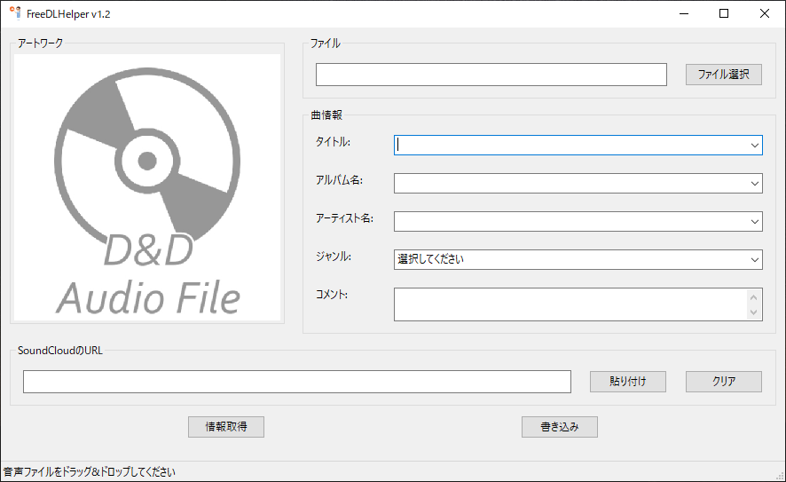

# FreeDLHelper v1.3
SoundCloudから楽曲情報・アートワーク画像を取得し、Free DLなどした音声ファイルに不足情報を追加するツールです。

## 環境
- Windows10 Python 3.6.8 \
macOSでの動作は確認していません

## インストールが必要なライブラリ
- Requests https://2.python-requests.org/en/master/
> `pip3 install requests`
- lxml https://lxml.de/
> `pip3 install lxml`
- regex https://bitbucket.org/mrabarnett/mrab-regex/src/default/
> `pip3 install regex`
- mutagen https://github.com/quodlibet/mutagen
> `pip3 install mutagen`
- wxPython http://wxPython.org/
> `pip3 install wxpython`
- pyperclip https://github.com/asweigart/pyperclip
> `pip3 install pyperclip`

## 使用方法
1. 上記のライブラリをインストールし、`py main.py` を実行
2. 曲情報を追加したい音声ファイルを、選択ダイアログまたはドラッグ&ドロップで選択
3. SoundCloudの対象曲のURLを貼り付け、"情報取得"を押して曲情報を取得
4. 取得した曲情報を確認・編集し、"書き込み"を押して音声ファイルに曲情報を書き込む

## 更新情報 (v1.3)
- 2019/09/17 v1.0
    - ソースコードのみリリース
- 2019/09/19 v1.1
    - exeファイルをリリース
    - SoundCloudからの情報取得時に、元の曲情報を保持するように \
    -> SoundCloudから取得した情報はドロップダウンリストから選択可能
    - URL入力欄をクリアするボタンを追加
    - 新たに曲を選択した場合、URL入力欄をクリアするように
    - ソフトによってコメントが表示されない問題を修正
- 2019/09/20 v1.1.1
    - ID3タグのないAIFFファイルが読み込めない問題を修正
- 2019/09/29 v1.2
    - MP4ファイルの対応拡張子を追加(.mp4, .m4b, .m4r)
    - URL入力欄に貼り付けボタンを設置、クリップボードのURLをワンクリックで貼り付けできるように
    - flac, mp4のタグのkeyがないときに半角スペースが入力される問題を修正
- 2019/10/27 v1.2.1
    - 曲情報が取得できないバグを修正
    - エスケープ文字の処理を修正
- 2020/03/04 v1.3
    - アイコンを変更
    - ダイアログでm4aファイルが選択できない問題を修正
    - アートワークのないm4aファイルを読み込んだ時、前回読み込んだアートワークがそのまま表示される問題を修正
    - コメントに何度もURLが追加されないように

## 確認している問題・バグ
- 一部の音声ファイルを読み込んだ際、曲情報が文字化けするものがある
- 高DPIディスプレイで起動した際の画面ボケ \
-> アプリのプロパティの"高DPI設定の変更"から多少改善できます