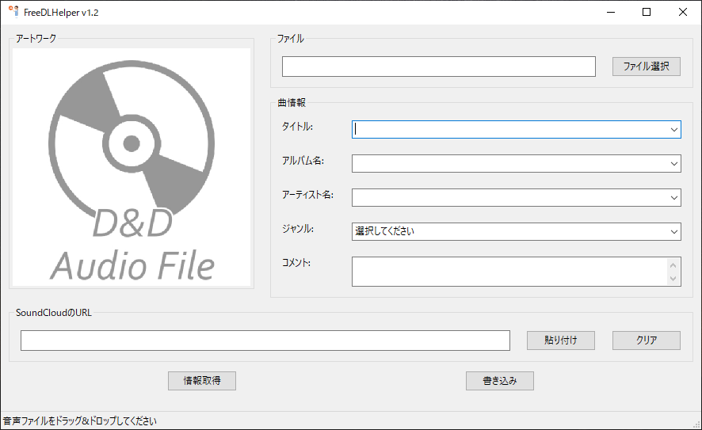

# FreeDLHelper v2.0.0
SoundCloudから楽曲情報・アートワーク画像を取得し、Free DLなどした音声ファイルに不足情報を追加するツールです。



## アプリのダウンロード
[こちら](https://github.com/Massu0921/FreeDLHelper/releases)からダウンロードできます。  
Windowsのみのリリースですm(__)m

### FFmpeg
[FFmpeg](https://ffmpeg.org/download.html#build-windows)をインストールすることで、楽曲情報書き込み時に`.wav`形式の音声ファイルを`.mp3`などの任意のフォーマットに変換することができます。  
フォーマットの指定は同梱されている`config.json`で行います。
指定方法は同梱されている`Readme.txt`もしくは[こちら](#configjson)を参考にしてください。

---
以下開発者向けです。
## 環境
- Windows 10 / 11 Python 3.10.10  
macOSでの動作は確認していません

## インストールが必要なライブラリ
次のコマンドでインストールしてください．  
```
pip install -r requirements.txt
```

以下のライブラリを使用しています．  
- Requests https://2.python-requests.org/en/master/
- lxml https://lxml.de/
- regex https://pypi.org/project/regex/
- mutagen https://github.com/quodlibet/mutagen
- wxPython http://wxPython.org/
- pyperclip https://github.com/asweigart/pyperclip

## 使用方法
1. 上記のライブラリをインストールし、`python -m FreeDLHelper` を実行
2. 曲情報を追加したい音声ファイルを、選択ダイアログまたはドラッグ&ドロップで選択
3. SoundCloudの対象曲のURLを貼り付け、"情報取得"を押して曲情報を取得
4. 取得した曲情報を確認・編集し、"書き込み"を押して音声ファイルに曲情報を書き込む

※wavの変換機能を使用する場合は，同じディレクトリにffmpegをインストール (or 環境変数にffmpegを追加)  

## config.json
このファイルを編集することで，ffmpegの変換フォーマット・オプションを変更できます．  
`"format"`で出力するフォーマットを指定，`"options"`内の指定したフォーマット部分を編集できます．  
以下以外のフォーマットに変換する場合，`"options"`に任意のフォーマットのオプションを追加してください．  
```json
{
    "format": "mp3",
    "options": {
        "mp3": "-vn -ac 2 -ar 44100 -ab 320k -acodec libmp3lame -f mp3",
        "flac": "-vn -ar 44100 -ac 2 -acodec flac -f flac",
        "aac": "-vn -ac 2 -ar 44100 -ab 128k -acodec libfaac -f mp4",
        "aiff": "-vn -ar 44100 -ac 2 -acodec pcm_s16be -f aiff"
    }
}
```

## 更新履歴
[こちら](./CHANGELOG.md)

## 確認している問題・バグ
- 一部の音声ファイルを読み込んだ際、曲情報が文字化けするものがある
